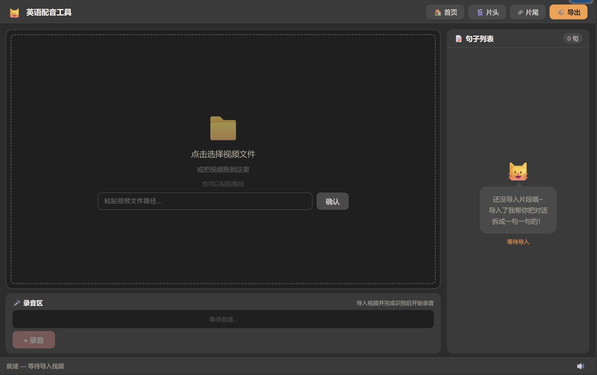

# 英语配音一站式工具

一个纯本地的英语配音工具，帮你给视频片段配上自己的声音。不需要联网，不需要注册，完全免费。

## 功能

- **截取片段**：从本地视频中截取任意片段
- **人声分离**：用 AI 把原片的人声和背景音/音效分开
- **自动识别对白**：用 AI 自动把片段里的对话拆成一句一句
- **逐句录音**：看着视频画面配音，录完自动播放消音画面 + 你的声音，让你检查口型
- **导出成片**：没录的句子保留原声，录了的句子替换成你的声音，最后合成完整视频

## 安装（给小白看的，一步一步来）

### 第 1 步：下载代码

点右上角绿色的 **Code** 按钮 → **Download ZIP**，下载后解压到任意文件夹。

### 第 2 步：安装 Python

如果你已经有 Python（3.10 以上版本），跳过这一步。

1. 打开 https://www.python.org/downloads/
2. 点黄色的 **Download Python** 按钮
3. 运行下载的安装程序
4. **重要**：安装时勾选底部的 **Add Python to PATH**
5. 点 Install Now

### 第 3 步：双击启动

进入解压后的文件夹，双击 **`start.bat`**。

首次启动会自动安装所需的依赖（Python 包、Node.js 包、ffmpeg），大概需要 5-10 分钟。后续启动只需几秒。

看到以下字样说明启动成功：

```
  === 英语配音工具 - 一键启动 ===
  [OK] Python 3.x
  [OK] Node.js
  [OK] ffmpeg
  [OK] Python 依赖
  [OK] 前端依赖
  启动服务...
  ================================
  正在打开浏览器 http://localhost:5173
```

浏览器会自动打开工具界面。如果没有，手动打开 http://localhost:5173

### 第 4 步：（如果启动报错）

- **"Python 未找到"**：重新安装 Python，确保勾选 Add to PATH
- **"Node.js 未找到"**：打开 https://nodejs.org ，下载安装 LTS 版本
- **"ffmpeg 安装失败"**：手动下载 https://ffmpeg.org/download.html 并安装
- 其他问题：把黑窗口里的错误信息发给我



## 使用教程

### 1. 导入视频

启动后看到一个大空白区域：
- **点击**空白区域，弹出文件选择框，选你的视频文件
- 或者**拖拽**视频文件到空白区域
- 或者粘贴视频的完整路径（比如 `D:\videos\S01E02.mkv`）

### 2. 截取片段

视频加载后，下面出现一条时间轴：
- **拖拽**橙色手柄选你要配的片段范围
- 点 **✂️ 截取片段**（几秒完成）

### 3. 分离人声 + 识别对白

截取完成后有两个按钮：
- **🎵 分离人声**：AI 把人声和背景音分开（1分钟片段大约需要2-4分钟）
- **📝 识别对白**：AI 把对话拆成一句一句（几秒到几十秒）

可以只点"识别对白"快速看句子，后面再分离人声。

**如果你之前用过，点 📂 复用数据 可以直接加载上次的数据，跳过这两步。**

### 4. 调整句子

右边出现句子列表：
- **点一句** → 视频自动播放原声片段
- **双击文字** → 编辑文本
- **点击时间戳** → 调整起止时间
- **勾选多句 → 点合并** → 合并为一句
- 调完自动保存

### 5. 录音

选中一句，下面录音区亮起：
- 点 **● 录音** → 视频消音播放（看着画面配音）→ 到时间自动停止
- 录完自动回放：消音画面 + 你的声音，看看口型对没对上
- 不满意重录，自动覆盖
- 点 **▶ 播放** 随时回放

### 6. 预览全片

录完后，调整下面的音量滑块（原声音量 / 录音音量），点 **👁 预览** 听整段效果。

### 7. 导出

点顶栏 **📦 导出**：
- 可选添加字幕（经典影视风）
- 可选加片头片尾
- 点 **开始导出**

导出的视频在 `projects/新作品_xxx/export/final.mp4`。

## 常见问题

**Q: 为什么我朋友用不了？他双击 start.bat 提示缺少东西？**
A: 他需要先装 Python 和 Node.js（看上面安装步骤）。

**Q: 转写的句子不准确怎么办？**
A: 这是 AI 自动识别，一定会有错。手动编辑文字和时间戳就好。

**Q: 导出后音画不同步？**
A: 不要合并句子后再用旧录音。合并后重新录对应的句子。

**Q: 怎么给朋友用？**
A: 把整个文件夹复制给他，他装好 Python 和 Node.js 后双击 start.bat 就行。

**Q: 我的视频是 MP4 格式，能用吗？**
A: 可以，MP4、MKV、AVI、MOV 都支持。

**Q: 项目文件夹太大怎么办？**
A: 删除 `projects` 文件夹里的旧项目，每个项目都包含视频副本，会占空间。

## 给开发者

- 前端：React + TypeScript + Vite（端口 5173）
- 后端：Python FastAPI（端口 8765）
- 人声分离：demucs (HTDemucs)
- 语音识别：faster-whisper (medium)
- 视频处理：ffmpeg
- 架构文档：`docs/ARCHITECTURE.md`
